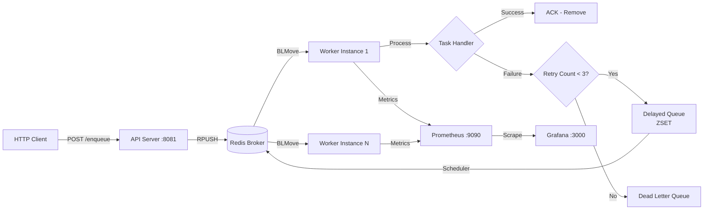

# DistributedQ - High Performance Distributed Task Queue

[](https://go.dev/)
[](https://redis.io/)
[](https://prometheus.io/)

DistributedQ is a **production-ready distributed task queue** written in Go, designed for high concurrency, fault tolerance, and observability. It leverages Redis as a message broker and provides real-time monitoring via Prometheus and Grafana.

---

## 🚀 Features

### Core Functionality
- ✅ **Distributed Architecture**: Horizontally scalable worker pool
- ✅ **Atomic Operations**: Uses Redis `BLMove` for exactly-once delivery semantics
- ✅ **Type-Safe Task Processing**: Generic task interface with type routing

### Reliability
- ✅ **Exponential Backoff Retry**: Automatic retry with `2^n * 100ms` delay
- ✅ **Dead Letter Queue (DLQ)**: Failed tasks preserved for inspection/replay
- ✅ **Graceful Shutdown**: Context-aware cancellation with signal handling
- ✅ **Atomic Scheduler**: Lua scripts prevent race conditions in delayed task processing
- ✅ **Rate Limiting**: Token bucket algorithm per task type
- ✅ **Priority Queues**: High, Default, and Low priority channels

### Observability
- ✅ **Prometheus Metrics**: Queue depth, throughput, latency, and worker utilization
- ✅ **Grafana Dashboards**: Pre-configured with visualization panels
- ✅ **Task-Level Tracing**: Per-type metrics for routing and debugging
- ✅ **Task-Level Tracing**: Per-type metrics for routing and debugging
- ✅ **Task Result Storage**: Store and retrieve task execution results

### 🖥️ Web Dashboard
- ✅ **Real-time Stats**: View queue depths and active tasks
- ✅ **Task Inspector**: Browse tasks in any queue (including history)
- ✅ **Task History**: View completed tasks in `completed_queue`
- ✅ **Control Panel**: Enqueue tasks directly from the UI for testing

---

## 📐 Architecture



### Queue Architecture

| Queue Name | Type | Purpose |
|------------|------|---------|
| Queue Name | Type | Purpose |
|------------|------|---------|
| `queue:high` | List | High priority tasks |
| `queue:default` | List | Default priority tasks |
| `queue:low` | List | Low priority tasks |
| `processing_queue` | List | Tasks currently being processed |
| `delayed_queue` | Sorted Set | Scheduled retries (score = timestamp) |
| `delayed_queue` | Sorted Set | Scheduled retries (score = timestamp) |
| `dead_letter_queue` | List | Permanently failed tasks |
| `completed_queue` | List | History of completed tasks (last 100) |

---

## 🔧 Quick Start

### Prerequisites
- Go 1.21+
- Docker & Docker Compose

### 1. Clone and Setup
```bash
git clone https://github.com/guido-cesarano/distributedq.git
cd distributedq
go mod download
```

### 2. Start Infrastructure
```bash
docker-compose up -d
```

This starts:
- **Redis** on `:6379`
- **Prometheus** on `:9091`
- **Grafana** on `:3000` (admin/admin)

### 3. Start Worker
```bash
go run cmd/worker/main.go
```

Output:
```
Metrics server listening on :8080
Worker started. Waiting for tasks...
```

### 4. Start API Server
```bash
go run cmd/server/main.go
```

Output:
```
Server listening on :8081
```
Server listening on :8081
```

### 5. Start Web Dashboard
```bash
cd dashboard
npm install
npm run dev
```

Navigate to `http://localhost:5173` to view the dashboard.

### 6. Enqueue Tasks
```bash
curl -X POST http://localhost:8081/enqueue \
  -H "Content-Type: application/json" \
  -H "X-API-Key: secret" \
  -d '{
    "type": "email",
    "payload": {
      "to": "user@example.com",
      "subject": "Welcome!",
      "body": "Thanks for signing up"
    }
  }'
```

### 6. Schedule a Recurring Task
```bash
curl -X POST http://localhost:8081/schedule \
  -H "Content-Type: application/json" \
  -d '{
    "spec": "@every 1m",
    "type": "cleanup",
    "payload": {}
  }'
```

### 7. Get Task Result
```bash
curl http://localhost:8081/result?id=<task_id>
```

Response:
```
Task enqueued: 8651ba0e-8b8a-4119-9a91-abb036b7f7e0
```

---

## 📚 API Reference

### POST /enqueue

Enqueues a new task to the distributed queue.

**Request:**
```json
{
{
  "type": "string",      // Task type for routing (e.g., "email", "notification")
  "priority": 1,         // Optional: 2=High, 1=Default, 0=Low
  "payload": {}          // Arbitrary JSON object with task data
}
```

### POST /schedule

Schedules a recurring task.

**Request:**
```json
{
  "spec": "@every 1m",   // Cron expression
  "type": "string",
  "payload": {}
}
```

### GET /result

Retrieves the result of a completed task.

**Query Param:** `id=<task_id>`

**Response:**
```json
{
  "status": "completed",
  "timestamp": "..."
}
```

**Response:**
```
Task enqueued: <uuid>
```

**Status Codes:**
- `200 OK` - Task successfully enqueued
- `400 Bad Request` - Invalid JSON payload
- `405 Method Not Allowed` - Non-POST request
- `500 Internal Server Error` - Redis connection failure

**Example Tasks:**

```bash
# Email task
curl -X POST http://localhost:8081/enqueue \
  -H "Content-Type: application/json" \
  -d '{"type":"email","payload":{"to":"user@example.com"}}'

# Notification task
curl -X POST http://localhost:8081/enqueue \
  -H "Content-Type: application/json" \
  -d '{"type":"notification","payload":{"user_id":123,"message":"Hello"}}'

# Image processing task
curl -X POST http://localhost:8081/enqueue \
  -H "Content-Type: application/json" \
  -d '{"type":"image_resize","payload":{"url":"https://example.com/img.jpg","width":800}}'
```

---

## 📊 Monitoring

### Prometheus Metrics

Access at `http://localhost:8080/metrics`

#### `distributedq_processed_total`
**Type:** Counter  
**Labels:** `status`, `type`  
**Description:** Total number of processed tasks

**Status values:**
- `success` - Task completed successfully
- `retry` - Task failed and scheduled for retry
- `failed` - Task exceeded max retries, moved to DLQ

**Example query:**
```promql
rate(distributedq_processed_total{status="success"}[5m])
```

#### `distributedq_task_duration_seconds`
**Type:** Histogram  
**Labels:** `type`  
**Description:** Task processing latency in seconds

**Example queries:**
```promql
# P95 latency across all task types
histogram_quantile(0.95, rate(distributedq_task_duration_seconds_bucket[5m]))

# P99 latency by task type
histogram_quantile(0.99, rate(distributedq_task_duration_seconds_bucket[5m])) by (type)
```

#### `distributedq_queue_depth`
**Type:** Gauge  
**Labels:** `queue`  
**Description:** Current number of tasks in each queue

**Queue labels:**
- `main_queue` - Tasks ready for processing
- `processing_queue` - Tasks being processed
- `delayed_queue` - Tasks scheduled for retry
- `dead_letter_queue` - Permanently failed tasks

**Example query:**
```promql
# Total tasks waiting
sum(distributedq_queue_depth{queue="main_queue"})

# Backlog alert (queue growing)
rate(distributedq_queue_depth{queue="main_queue"}[5m]) > 0
```

### Grafana Dashboard

Access at `http://localhost:3000` (default credentials: `admin/admin`)

The pre-configured dashboard includes:

1. **Task Processing Rate** - Tasks/second by status and type
2. **Total Tasks Processed** - Cumulative counter gauge
3. **Task Duration Percentiles** - P50/P95/P99 latency
4. **Task Status Distribution** - Success vs Retry vs Failed breakdown

---

## ⚙️ Configuration

### Worker Configuration

Edit [cmd/worker/main.go](file:///Users/guido-cesarano/Portfolio/distributedq/cmd/worker/main.go):

```go
// Redis connection
client := queue.NewClient("localhost:6379")

// Max retry attempts (default: 3)
if task.RetryCount < 3 {
    client.Retry(ctx, *task, raw)
}

// Metrics server port (default: 8080)
http.ListenAndServe(":8080", nil)
```

### Server Configuration

Edit [cmd/server/main.go](file:///Users/guido-cesarano/Portfolio/distributedq/cmd/server/main.go):

```go
// Redis connection
client := queue.NewClient("localhost:6379")

// Server port (default: 8081)
http.ListenAndServe(":8081", nil)
```

### Retry Backoff

The retry delay follows exponential backoff: `2^retryCount * 100ms`

| Retry | Delay |
|-------|-------|
| 1 | 200ms |
| 2 | 400ms |
| 3 | 800ms |

---

## 🏗️ Project Structure

```
distributedq/
├── cmd/
│   ├── server/          # HTTP API for task enqueuing
│   │   └── main.go
│   └── worker/          # Task processor with metrics
│       └── main.go
├── pkg/
│   ├── queue/           # Redis client & queue operations
│   │   └── client.go
│   └── tasks/           # Task data structures
│       └── task.go
├── grafana/
│   └── provisioning/    # Auto-loaded datasources & dashboards
│       ├── datasources/
│       └── dashboards/
├── docker-compose.yml   # Infrastructure setup
├── prometheus.yml       # Metrics scraping config
└── go.mod
```

---

## 🔬 Development

### Run Tests
```bash
go test ./...
```

### View Documentation
```bash
# Package documentation
go doc ./pkg/queue
go doc ./pkg/tasks

# Specific function
go doc queue.Client.Retry

# Start godoc server
godoc -http=:6060
# Visit: http://localhost:6060/pkg/github.com/guido-cesarano/distributedq/
```

### Inspect Dead Letter Queue
```bash
# Connect to Redis
docker exec -it distributedq-redis-1 redis-cli

# List failed tasks
LRANGE dead_letter_queue 0 -1

# Count failed tasks
LLEN dead_letter_queue
```

### Inspect Delayed Queue
```bash
# View delayed tasks with timestamps
ZRANGE delayed_queue 0 -1 WITHSCORES

# Count delayed tasks
ZCARD delayed_queue
```

---

## 🚢 Production Deployment

### Horizontal Scaling

Run multiple worker instances:
```bash
# Terminal 1
go run cmd/worker/main.go

# Terminal 2
go run cmd/worker/main.go

# Terminal N
go run cmd/worker/main.go
```

Workers automatically coordinate via Redis `BLMove` atomic operations.

### Production Deployment

For production deployment with Docker Compose, see the **[Production Deployment Guide](file:///Users/guido-cesarano/Portfolio/distributedq/docs/DEPLOYMENT.md)**.

Quick start:
```bash
# Copy environment template
cp .env.example .env

# Edit configuration (set passwords)
nano .env

# Build and start with production settings
docker-compose -f docker-compose.prod.yml up -d --build
```

**Features:**
- ✅ Health checks for all services
- ✅ Resource limits and reservations
- ✅ Data persistence with volumes
- ✅ Redis authentication
- ✅ Horizontal worker scaling (3 replicas by default)
- ✅ 30-day Prometheus retention

### Docker Deployment (Custom)

Build worker image:
```dockerfile
FROM golang:1.21-alpine AS builder
WORKDIR /app
COPY . .
RUN go build -o worker cmd/worker/main.go

FROM alpine:latest
COPY --from=builder /app/worker /worker
EXPOSE 8080
CMD ["/worker"]
```

### Environment Variables (Recommended)

redisAddr := os.Getenv("REDIS_ADDR")
if redisAddr == "" {
    redisAddr = "localhost:6379"
}
client := queue.NewClient(redisAddr)

// Set API Key
// export API_KEY=your-secret-key
```

---

## 🎯 Use Cases

- **Email Delivery**: Asynchronous email sending with retry on SMTP failures
- **Image Processing**: Thumbnail generation, watermarking, format conversion
- **Webhooks**: Reliable webhook delivery with exponential backoff
- **Data Export**: Large CSV/PDF generation without blocking HTTP requests
- **Scheduled Jobs**: Cron-like task scheduling via delayed queue
- **Notifications**: Push notifications, SMS, in-app alerts

---

## 📈 Benchmarks

Performance tested on MacBook (local Docker Redis):

### Enqueue Throughput

```bash
go run benchmark/main.go -tasks 100000 -workers 10
```

| Metric | Value |
|--------|-------|
| **Tasks Enqueued** | 100,000 |
| **Enqueue Time** | ~3.3s |
| **Throughput** | **~30,000 tasks/sec** |

### Processing Throughput

Processing speed depends on task complexity. With simulated 100ms processing time per task:

| Metric | Value |
|--------|-------|
| **Processing Rate** | ~10 tasks/sec (single worker) |
| **Scalability** | Linear with worker count |

### Key Performance Indicators

- **Latency (P50)**: < 110ms
- **Latency (P95)**: < 150ms
- **Latency (P99)**: < 200ms
- **Memory Usage**: ~25MB per worker process
- **Redis Overhead**: Minimal (atomic operations)

### Comparison with Other Frameworks

| Framework | Language | Enqueue (tasks/sec) | Notes |
|-----------|----------|---------------------|-------|
| **DistributedQ** | Go | ~30,000 | This project |
| Celery | Python | ~5,000-10,000 | With Redis broker |
| Bull | Node.js | ~15,000-20,000 | Redis-based queue |
| Sidekiq | Ruby | ~8,000-12,000 | Multi-threaded |

> **Note**: Benchmarks are approximate and vary based on hardware, network latency, and task payload size. DistributedQ benefits from Go's efficient goroutines and native concurrency primitives.

### Running Your Own Benchmark

```bash
# Ensure worker is running
go run cmd/worker/main.go

# In another terminal
go run benchmark/main.go -tasks 100000 -workers 10
```

**Benchmark Options:**
- `-tasks`: Number of tasks to enqueue (default: 100000)
- `-workers`: Number of concurrent enqueuers (default: 10)


---

## 🚀 Next Steps (Future Enhancements)

The following features are planned for future releases to make DistributedQ even more powerful and production-ready:

The following features are planned for future releases to make DistributedQ even more powerful and production-ready:

### 🔄 Distributed Consensus
- **Description**: Leader election for multiple server instances
- **Use Case**: High availability scheduling
- **Effort**: High

### 📦 Client Libraries
- **Description**: SDKs for Python and Node.js
- **Use Case**: Easier integration for non-Go consumers
- **Effort**: Medium

---

## 🤝 Contributing

Contributions are welcome! Please feel free to submit a Pull Request.

---

## 📄 License

MIT License - see LICENSE file for details

---

## 🙏 Acknowledgments

Built with:
- [Redis](https://redis.io/) - Message broker
- [Prometheus](https://prometheus.io/) - Metrics collection
- [Grafana](https://grafana.com/) - Visualization
- [go-redis](https://github.com/redis/go-redis) - Redis client for Go

---

**Author**: Guido Cesarano  
**GitHub**: [guido-cesarano/distributedq](https://github.com/guido-cesarano/distributedq)
