# Architecture Guide

## Overview

DistributedQ is a distributed task queue system built with Go and Redis, designed for reliability, scalability, and observability. This guide explains the system's architecture, design decisions, and implementation details.

---

## System Components

### 1. API Server (`cmd/server`)

**Purpose:** HTTP endpoint for task enqueuing

**Responsibilities:**
- Accept HTTP POST requests with task data
- Generate unique task IDs (UUID v4)
- Serialize tasks to JSON
- Push tasks to Redis main queue

**Port:** 8081 (default)

**Technology:** Go `net/http` standard library
- **Cron Scheduler**: Background service for recurring tasks


---

### 2. Worker (`cmd/worker`)

**Purpose:** Task processor with retry logic and metrics

**Responsibilities:**
- Dequeue tasks atomically from Redis
- Execute task processing logic
- Handle success/failure scenarios
- Implement retry with exponential backoff
- Expose Prometheus metrics

**Port:** 8080 (metrics endpoint)

**Technology:** Go goroutines for concurrency

---

### 3. Redis Broker

**Purpose:** Message queue and state management

**Data Structures:**
- **List** - `queue:high`, `queue:default`, `queue:low` (Priority Queues)
- **List** - `processing_queue`, `dead_letter_queue`
- **Sorted Set (ZSET)** - `delayed_queue` (score = Unix timestamp)

**Port:** 6379

**Technology:** Redis 7.0+

---

### 4. Monitoring Stack

**Prometheus:**
- Scrapes metrics from worker every 15 seconds
- Stores time-series data
- Port: 9091

**Grafana:**
- Visualizes Prometheus metrics
- Pre-configured dashboard with 4 panels
- Port: 3000

---

## Data Flow

### Task Enqueuing Flow


### Task Processing Flow

```mermaid
sequenceDiagram
    participant W as Worker
    participant R as Redis
    participant P as Prometheus
    
    W->>R: BLMove queue:high/default/low → processing_queue
    R-->>W: Task JSON
    W->>W: Check Rate Limit (Token Bucket)
    alt Rate Limit Exceeded
        W->>R: Retry (Delay 5s)
    else Allowed
        W->>W: Unmarshal & Process
    end
    
    alt Success
        W->>R: LREM processing_queue
        W->>P: Increment success counter
    else Failure (retry < 3)
        W->>W: Increment RetryCount
        W->>W: Calculate backoff
        W->>R: ZADD delayed_queue (score=future_time)
        W->>R: LREM processing_queue
        W->>P: Increment retry counter
    else Failure (retry >= 3)
        W->>R: RPUSH dead_letter_queue
        W->>R: LREM processing_queue
        W->>P: Increment failed counter
    end
```



### Delayed Task Scheduling Flow


---

## Design Decisions

### 1. Atomic Operations with BLMove

**Problem:** Ensure exactly-once delivery semantics

**Solution:** Use Redis `BLMove` command

**Benefits:**
- Atomically moves task from main queue to processing queue
- Prevents task loss during worker crashes
- No need for separate acknowledgment mechanism

**Alternative Considered:** LPOP + RPUSH (non-atomic, risk of task loss)

---

### 2. Lua Scripts for Scheduler

**Problem:** Race conditions when multiple schedulers run

**Solution:** Use Lua script for atomic ZRANGEBYSCORE + ZREM + RPUSH

**Benefits:**
- Ensures single execution of delayed tasks
- No race conditions between scheduler instances
- Reduces Redis round trips

**Code:**
```lua
local tasks = redis.call('ZRANGEBYSCORE', delayed_key, '-inf', now)
if #tasks > 0 then
    redis.call('ZREMRANGEBYSCORE', delayed_key, '-inf', now)
    for _, task in ipairs(tasks) do
        redis.call('RPUSH', main_queue_key, task)
    end
end
return #tasks
```

---

### 3. Exponential Backoff Retry

**Formula:** `2^retryCount * 100ms`

**Rationale:**
- Prevents overwhelming downstream services
- Gives transient errors time to resolve
- Standard industry practice

**Example:**
| Retry | Delay |
|-------|-------|
| 1st   | 200ms |
| 2nd   | 400ms |
| 3rd   | 800ms |

---

### 4. Dead Letter Queue (DLQ)

**Purpose:** Preserve failed tasks for debugging

**Benefits:**
- No data loss for permanently failed tasks
- Manual inspection and replay capability
- Helps identify systemic issues

**Access:**
```bash
redis-cli LRANGE dead_letter_queue 0 -1
```

---

### 5. Prometheus Histogram for Latency

**Why Histogram?**
- Enables percentile calculations (P50, P95, P99)
- More efficient than recording individual timings
- Standard for SLI/SLO tracking

**Buckets:** Prometheus default buckets ([0.005, 0.01, 0.025, 0.05, 0.1, 0.25, 0.5, 1, 2.5, 5, 10])

---

## Scalability Considerations

### Horizontal Worker Scaling

DistributedQ supports running multiple worker instances:

```bash
# Start 3 workers
go run cmd/worker/main.go &  # Worker 1
go run cmd/worker/main.go &  # Worker 2
go run cmd/worker/main.go &  # Worker 3
```

**Coordination:**
- Redis `BLMove` provides atomic dequeuing
- Each worker gets unique tasks
- No coordination protocol needed

**Scheduler:**
- Only ONE scheduler should run per deployment
- Lua script prevents duplicate processing
- Consider leader election for multi-scheduler setup

---

### Vertical Scaling

**Worker Concurrency:**

Current: Single-threaded processing

**Improvement:** Add worker pool

```go
func startWorker(ctx context.Context, client *queue.Client) {
    workerCount := runtime.NumCPU()
    
    for i := 0; i < workerCount; i++ {
        go func() {
            for {
                // Dequeue and process
            }
        }()
    }
}
```

---

### Redis Scaling

For high throughput:
1. **Redis Cluster** - Shard across multiple nodes
2. **Redis Sentinel** - High availability with automatic failover
3. **Redis Persistent** - Enable AOF or RDB snapshots

---

## Reliability Features

### 1. Graceful Shutdown

**Implementation:**
```go
sigChan := make(chan os.Signal, 1)
signal.Notify(sigChan, syscall.SIGINT, syscall.SIGTERM)

go func() {
    <-sigChan
    cancel()  // Cancel context
}()
```

**Behavior:**
- Worker finishes current task before exiting
- No partial task processing
- Clean shutdown on SIGINT/SIGTERM

---

### 2. Task Persistence

**Redis Persistence:**
- Enable RDB snapshots every N seconds
- Or enable AOF (Append Only File) for durability

**Configuration:**
```bash
# docker-compose.yml
redis:
  command: redis-server --appendonly yes
```

---

### 3. Idempotency

**Recommendation:** Design task handlers to be idempotent

**Example:**
```go
func processEmailTask(task *tasks.Task) error {
    // Check if email already sent (idempotency)
    if alreadySent(task.ID) {
        return nil
    }
    
    // Send email
    err := sendEmail(task.Payload)
    
    // Mark as sent
    markSent(task.ID)
    
    return err
}
```

---

## Security Considerations

### 1. Authentication
API Key authentication is implemented via middleware.
- **Mechanism**: `X-API-Key` header check.
- **Configuration**: `API_KEY` environment variable.
- **Behavior**: Returns `401 Unauthorized` if key is invalid.

### 2. Input Validation
Validate task types and payload structure

### 3. Network Security
- Use TLS for Redis connections in production
- Restrict Redis access via firewall rules
- Use VPC/private networks

### 4. Secret Management
Store Redis passwords in environment variables or secret managers

---

## Performance Characteristics

### Throughput

**Estimated:** ~10,000 tasks/second (single worker, simple tasks)

**Bottlenecks:**
1. Redis network latency
2. Task processing time
3. Worker CPU/memory

### Latency

**Components:**
- Enqueue: < 5ms (Redis RPUSH)
- Dequeue: < 5ms (Redis BLMove)
- Processing: Depends on task handler
- Retry scheduling: < 10ms (ZADD + pipeline)

---

## Future Improvements

1. **Worker Pool**: Concurrent task processing per worker instance
2. **Task Dependencies**: Wait for parent tasks before execution
3. **Batch Processing**: Process multiple tasks together
4. **Task Chaining**: Automatic chaining of dependent tasks
5. **Web UI**: Dashboard for queue inspection and management

---

## References

- [Redis Documentation](https://redis.io/docs/)
- [Prometheus Best Practices](https://prometheus.io/docs/practices/)
- [Go Concurrency Patterns](https://go.dev/blog/pipelines)
- [Exponential Backoff Algorithm](https://en.wikipedia.org/wiki/Exponential_backoff)
